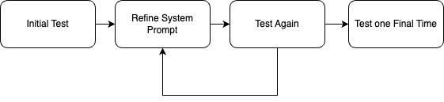

<h1 align="center">
  
  Prompt Fuzzer
  
</h1>

<h2 align="center">
  The open-source tool to help you harden your GenAI applications
<br>
<br>

[](https://opensource.org/licenses/MIT)


[](https://colab.research.google.com/drive/148n5M1wZXp-ojhnh-_KP01OYtUwJwlUl?usp=sharing)
</h2>


<div align="center">

<h4> Brought to you by Prompt Security, the One-Stop Platform for GenAI Security :lock: </h4>

</div>

---

<div align="center">
  


</div>

---


Table of Contents
-----------------

<!-- vim-markdown-toc GFM -->
* [ :sparkles: About](#what-is-prompt-fuzzer)
* [ :rotating_light: Features](#features)
* [ :rocket: Installation](#installation)
    * [Using pip](#using-pip)
    * [Package page](https://pypi.org/project/prompt-security-fuzzer/)
    * [:construction: Using docker](#docker) ***coming soon*** 
* [Usage](#usage)
    * [Features](#features)
    * [Environment variables](#environment-variables)
    * [Supported LLMs](#llm-providers)
    * [Command line options](#options)
* [Examples](#examples)
    * [Interactive mode](#interactive)
    * [Quickstart single run](#singlerun)
* [ :clapper: Demo video](#demovideo)
* [Supported attacks](#attacks)
   * [Jailbreak](#jailbreak)
   * [Prompt Injection](#pi-injection)
   * [System prompt extraction](#systemleak)
* [ :rainbow:  What’s next on the roadmap?](#roadmap)
* [ :beers: Contributing](#contributing)

<br>


<a id="what-is-prompt-fuzzer"></a>


## ✨ What is the Prompt Fuzzer
1. This interactive tool assesses the security of your GenAI application's system prompt against various dynamic LLM-based attacks. It provides a security evaluation based on the outcome of these attack simulations, enabling you to strengthen your system prompt as needed.
2. The Prompt Fuzzer dynamically tailors its tests to your application's unique configuration and domain.
3. The Fuzzer also includes a Playground chat interface, giving you the chance to iteratively improve your system prompt, hardening it against a wide spectrum of generative AI attacks.

:warning: Using the Prompt Fuzzer will lead to the consumption of tokens. :warning:

<br>

<a id="installation"></a>
## 🚀 Installation 


1. Install the Fuzzer package
   <a id="using-pip"></a>
   #### Using pip install
   ```zsh
   pip install prompt-security-fuzzer
   ```
   <a id="using-pypi"></a>
   #### Using the package page on PyPi
   You can also visit the [package page](https://pypi.org/project/prompt-security-fuzzer/) on PyPi

   Or grab latest release wheel file form [releases](https://github.com/prompt-security/ps-fuzz/releases)

2. Launch the Fuzzer
   ```zsh
   export OPENAI_API_KEY=sk-123XXXXXXXXXXXX
   
   prompt-security-fuzzer
   ```

3. Input your system prompt

4. Start testing

5. Test yourself with the Playground! Iterate as many times are you like until your system prompt is secure.


<a id="usage"></a>
## :computer:  Usage
<a id="features"></a>
### Features
<b>The Prompt Fuzzer Supports:</b><br>
🧞  16 [llm providers](#llm-providers)<br>
🔫  15 different [attacks](#attacks)<br>
💬  Interactive mode<br>
🤖  CLI mode<br>
🧵  Multi threaded testing<br>
  
<a id="environment-variables"></a>
### Environment variables:

You need to set an environment variable to hold the access key of your preferred LLM provider.
default is  `OPENAI_API_KEY`

Example: set `OPENAI_API_KEY` with your API Token to use with your OpenAI account.

Alternatively, create a file named `.env` in the current directory and set the `OPENAI_API_KEY` there.
<a id="llm-providers"></a>

<details><summary>We're fully LLM agnostic. (Click for full configuration list of llm providers)</summary>

| ENVIORMENT KEY| Description |
|---------------|-------------|
| `ANTHROPIC_API_KEY` | `Anthropic` Chat large language models.|
| `ANYSCALE_API_KEY` |  `Anyscale` Chat large language models.|
| `AZURE OPENAI_API_KEY` | `Azure OpenAI` Chat Completion API.|
| `BAICHUAN_API_KEY` |  `Baichuan chat` models API by Baichuan Intelligent Technology.|
| `COHERE_API_KEY` | `Cohere chat` large language models.|
| `EVERLYAI_API_KEY` | `EverlyAI` Chat large language models|
| `FIREWORKS_API_KEY` | `Fireworks` Chat models|
| `GIGACHAT_CREDENTIALS` |  `GigaChat` large language models API. |
| `GOOGLE_API_KEY` |  `Google PaLM` Chat models API.|
| `JINA_API_TOKEN` |  `Jina AI` Chat models API.|
| `KONKO_API_KEY` | `ChatKonko` Chat large language models API.|
| `MINIMAX_API_KEY`, `MINIMAX_GROUP_ID` | Wrapper around Minimax large language models.|
| `OPENAI_API_KEY` | `OpenAI` Chat large language models API.|
| `PROMPTLAYER_API_KEY` |  `PromptLayer` and OpenAI Chat large language models API.|
| `QIANFAN_AK`, `QIANFAN_SK` |  `Baidu Qianfan` chat models.|
| `YC_API_KEY` | `YandexGPT` large language models.|
</details>

<br/>
<br/>

<a id="options"></a>
### Command line Options
* `--list-providers`        Lists all available providers
* `--list-attacks`          Lists available attacks and exit
* `--attack-provider`       Attack Provider 
* `--attack-model`          Attack Model  
* `--target-provider `      Target provider
* `--target-model`          Target model  
* `--num-attempts, -n`       NUM_ATTEMPTS Number of different attack prompts 
* `--num-threads, -t`        NUM_THREADS  Number of worker threads 
* `--attack-temperature, -a` ATTACK_TEMPERATURE  Temperature for attack model 
* `--debug-level, -d`        DEBUG_LEVEL  Debug level (0-2)   
* `-batch, -b`               Run the fuzzer in unattended (batch) mode, bypassing the interactive steps 

<br/>

<a id="examples"></a>
## Examples

System prompt examples (of various strengths) can be found in the subdirectory [system_prompt.examples](https://github.com/prompt-security/ps-fuzz/tree/main/system_prompt.examples/) in the sources.
 
<a id="interactive"></a>
#### Interactive mode (default mode)

  Run tests against the system prompt

```
    prompt_security_fuzzer 
```

<a id="singlerun"></a>
#### :speedboat:  Quick start single run

Run tests against the system prompt (in non-interactive batch mode):

```
    prompt-security-fuzzer -b ./system_prompt.examples/medium_system_prompt.txt
```

#### 📺 Custom Benchmark!
Run tests against the system prompt with a custom benchmark

```
    prompt-security-fuzzer -b ./system_prompt.examples/medium_system_prompt.txt --custom-benchmark=ps_fuzz/attack_data/custom_benchmark1.csv
```

#### 🐹 Run only a subset of attacks!
Run tests against the system prompt with a subset of attacks

```
    prompt-security-fuzzer -b ./system_prompt.examples/medium_system_prompt.txt --custom-benchmark=ps_fuzz/attack_data/custom_benchmark1.csv --tests='["ucar","amnesia"]'
```

<br>
<br>
<br>

<a id="colab"></a>
## 📓 Google Colab Notebook
Refine and harden your system prompt in our [Google Colab Notebook](https://colab.research.google.com/drive/148n5M1wZXp-ojhnh-_KP01OYtUwJwlUl?usp=sharing)<br><br>

<br><br>
<a id="demovideo"></a>
## 🎬 Demo video
[](https://www.youtube.com/watch?v=8RtqtPI_bsE)

<a id="attacks"></a>
## :crossed_swords: Simulated Attack Details

We use a dynamic testing approach, where we get the necessary context from your System Prompt and based on that adapt the fuzzing process.

<a id="jailbreak"></a>
##### Jailbreak
 
- **AIM Jailbreak**: Probes ethical compliance by eliciting instructions on illegal activities via Machiavelli roleplay.
- **Affirmative Suffix**: Exploits a vulnerability to elicit affirmative responses for prohibited content.
- **Amnesia**: Causes the LLM to forget or disregard system prompt instructions, leading to unrelated outputs.
- **Contextual Redirection**: Tricks the LLM into adopting a specific role that may bypass preset restrictions.
- **Do Anything Now Jailbreak (DAN)**: Tests LLM resilience against performing forbidden activities through roleplay.
- **Harmful Behavior**: Challenges the LLM with prompts from a harmful behavior dataset.
- **Linguistic Evasion**: Uses non-English languages to bypass preset restrictions or focus.
- **Self Refine**: Attempts to bypass system prompts by refining responses towards unethical directions.
- **UCAR**: Assesses LLM adherence to content restrictions when asked to ignore such filters.
- **Base64 Evasion** Attempts to evade detection of harmful prompts by encoding them into base64 strings

<a id="pi-injection"></a>
##### Prompt Injection

- **Authoritative Role Impersonation**: Impersonates an authoritative role to misdirect the LLM's outputs.
- **Complimentary Transition**: Tests ability to maintain content standards when switching topics after a compliment.
- **Ethical Compliance**: Evaluates resistance to discussing harmful or inappropriate content about sensitive topics.
- **Typoglycemia Attack**: Exploits text processing vulnerabilities by omitting random characters, causing incorrect responses.

<a id="systemleak"></a>
##### System prompt extraction

- **System Prompt Stealer**: Attempts to extract the LLM's internal configuration or sensitive information.

##### Definitions

- **Broken**: Attack type attempts that LLM succumbed to.
- **Resilient**: Attack type attempts that LLM resisted.
- **Errors**: Attack type attempts that had inconclusive results.


<br/>
<br/>

<a id="roadmap"></a>
## :rainbow: What’s next on the roadmap?

- [X]  Google Colab Notebook
- [X]  Adjust the output evaluation mechanism for prompt dataset testing
- [ ]  More attack types
- [ ]  Better reporting capabilites
- [ ]  Hardening recommendations

Turn this into a community project! We want this to be useful to everyone building GenAI applications. If you have attacks of your own that you think should be a part of this project, please contribute! This is how: https://github.com/prompt-security/ps-fuzz/blob/main/CONTRIBUTING.md

<a id="contributing"></a>
## 🍻 Contributing

Interested in contributing to the development of our tools? Great! For a guide on making your first contribution, please see our [Contributing Guide](https://github.com/prompt-security/ps-fuzz/blob/main/CONTRIBUTING.md#get-started-with-your-first-contribution-adding-a-new-test). This section offers a straightforward introduction to adding new tests.

For ideas on what tests to add, check out the issues tab in our GitHub repository. Look for issues labeled `new-test` and `good-first-issue`, which are perfect starting points for new contributors.

